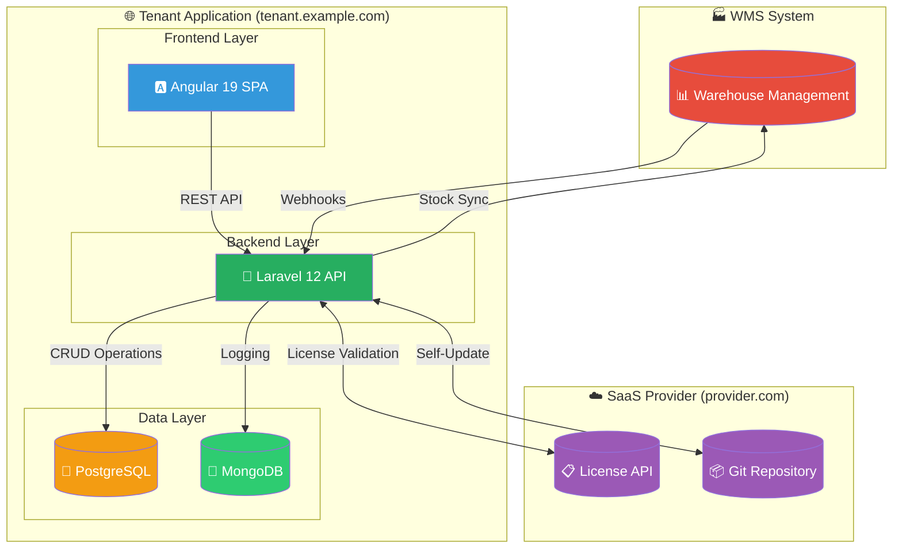
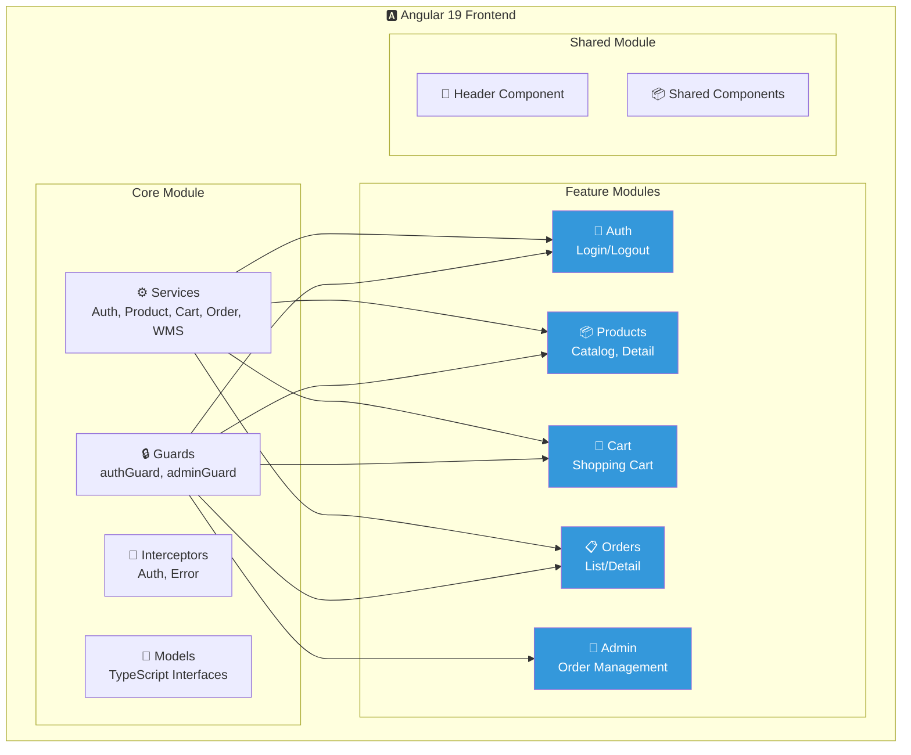
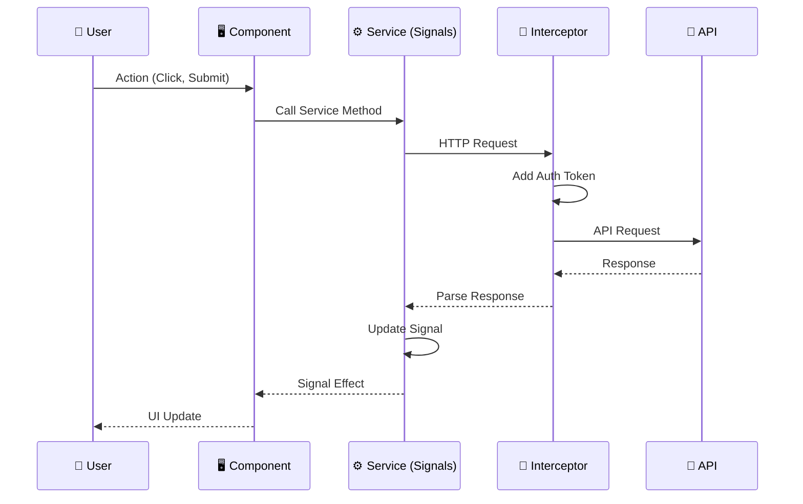
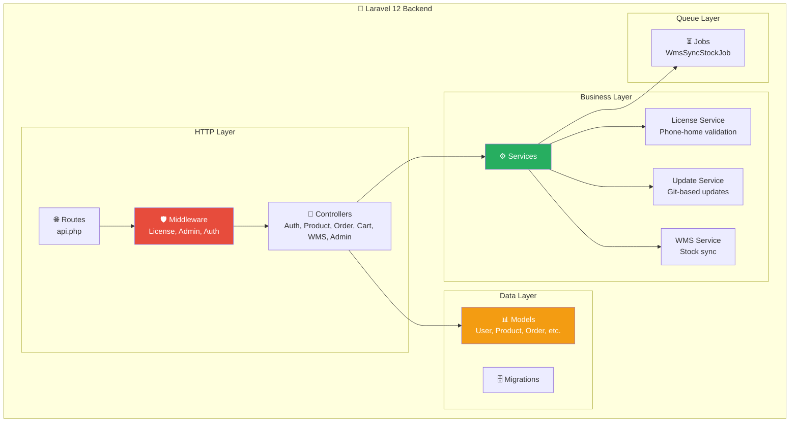
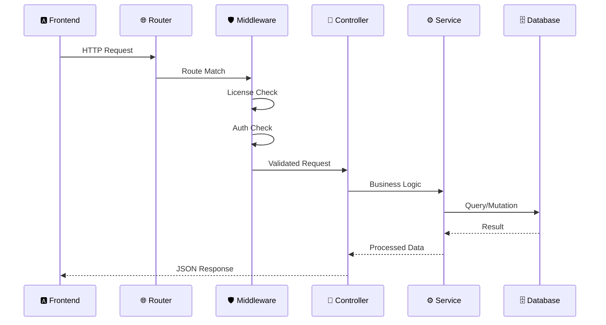
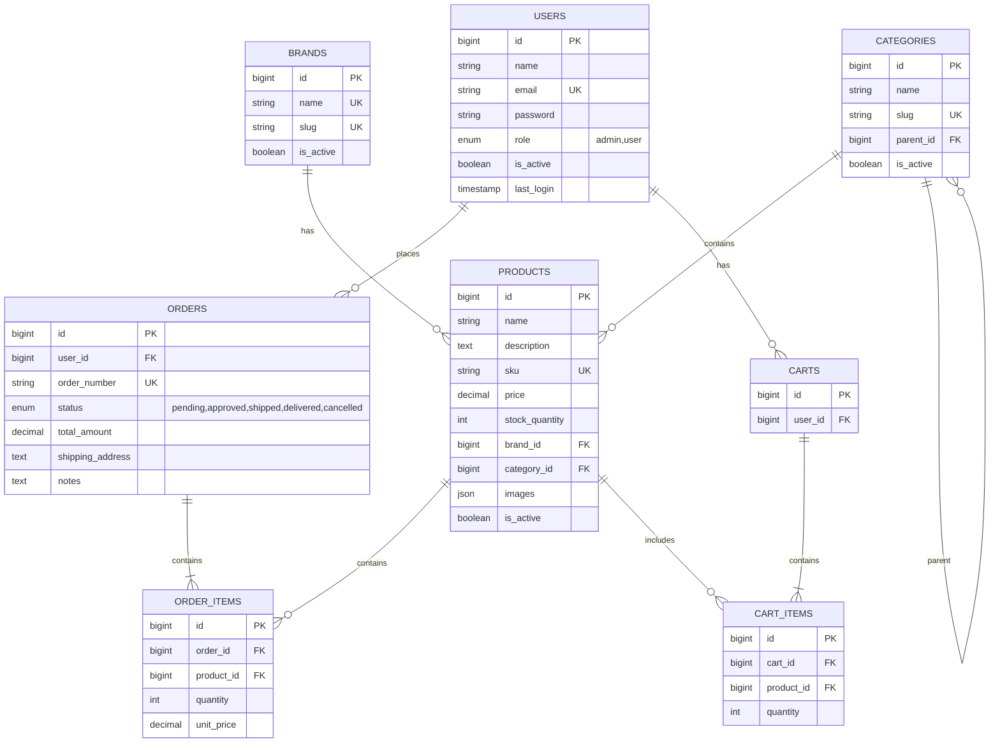
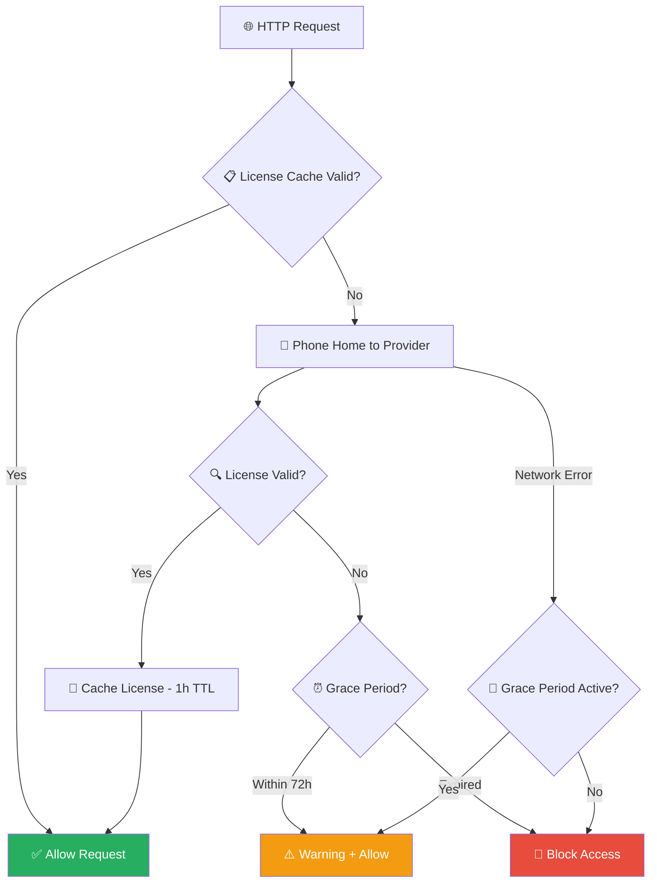
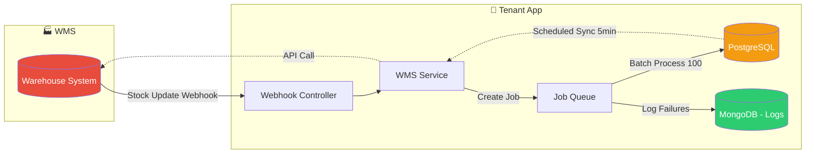
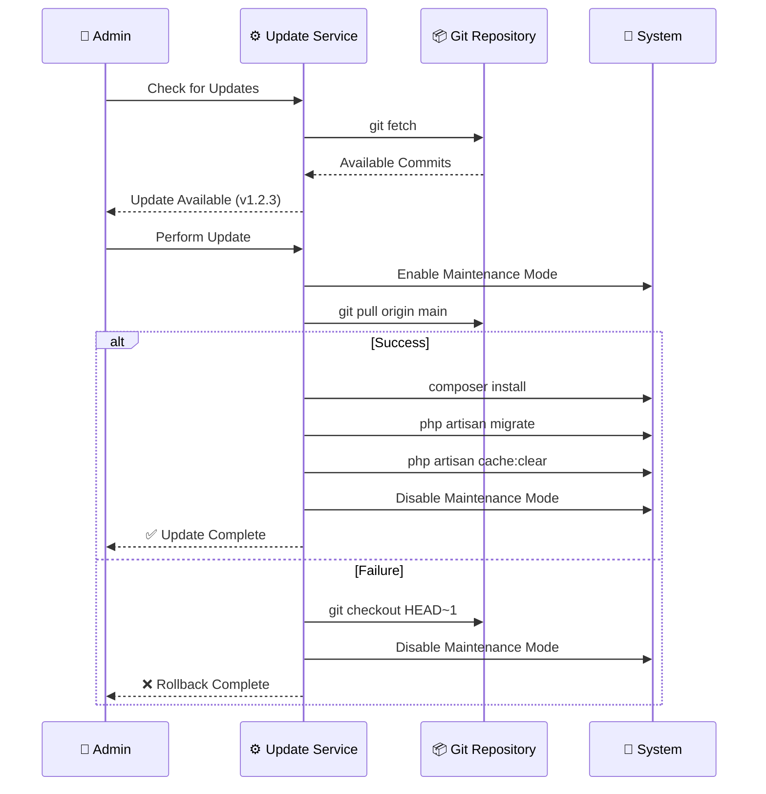
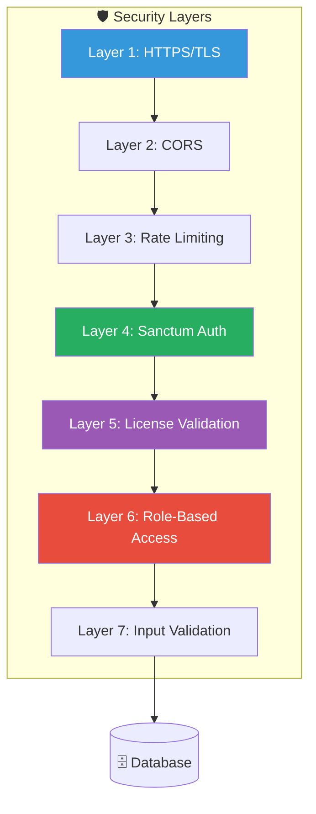

# 🏗️ Distributed B2B SaaS Platform - Detaylı Mimari

## Genel Bakış

Bu platform, her kiracının (tenant) kendi izole ortamına, domain'ine ve veritabanına sahip olduğu dağıtık bir B2B SaaS çözümüdür.

---

## 1. Sistem Mimarisi - Üst Düzey



---

## 2. Angular 19 Frontend Mimarisi



### Frontend Veri Akışı (Signals ile)



---

## 3. Laravel 12 Backend Mimarisi



### Request Lifecycle



---

## 4. Veritabanı Şeması



---

## 5. Lisans Doğrulama Akışı



---

## 6. WMS Senkronizasyon Akışı



---

## 7. Self-Update Mekanizması



---

## 8. Dosya Yapısı

```
internetprogramlama/
├── 📦 tenant-app/                    # Laravel 12 Backend
│   ├── app/
│   │   ├── Enums/                   # OrderStatus, UserRole
│   │   ├── Http/
│   │   │   ├── Controllers/Api/     # 8 Controller
│   │   │   └── Middleware/          # LicenseMiddleware, AdminMiddleware
│   │   ├── Jobs/                    # WmsSyncStockJob
│   │   ├── Models/                  # 10 Eloquent Model
│   │   └── Services/
│   │       ├── License/             # Phone-home doğrulama
│   │       ├── Update/              # Self-update servisi
│   │       └── Wms/                 # WMS senkronizasyon
│   ├── config/
│   │   ├── license.php              # Lisans yapılandırması
│   │   └── wms.php                  # WMS yapılandırması
│   └── database/migrations/         # 12 migration dosyası
│
├── 🅰️ tenant-frontend/               # Angular 19 Frontend
│   ├── src/app/
│   │   ├── core/
│   │   │   ├── guards/              # authGuard, adminGuard
│   │   │   ├── interceptors/        # Auth, Error interceptors
│   │   │   ├── models/              # TypeScript interfaces
│   │   │   └── services/            # 5 servis (Signals ile)
│   │   ├── features/
│   │   │   ├── admin/               # Admin sipariş yönetimi
│   │   │   ├── auth/                # Login
│   │   │   ├── cart/                # Alışveriş sepeti
│   │   │   ├── orders/              # Sipariş listesi/detay
│   │   │   └── products/            # Ürün kataloğu
│   │   └── shared/components/       # Header
│   └── tailwind.config.js
│
├── 🐳 docker-compose.yml             # Tüm servislerin orkestasyonu
├── 🐳 Dockerfile                     # Laravel container imajı
└── 📚 memory_bank/                   # Proje dökümanları
```

---

## 9. Teknoloji Stack'i

| Katman | Teknoloji | Versiyon | Açıklama |
|--------|-----------|----------|----------|
| **Frontend** | Angular | 19 | Signals ile reaktif UI |
| **Styling** | TailwindCSS | 3.x | Utility-first CSS |
| **Backend** | Laravel | 12 | PHP API Framework |
| **Auth** | Sanctum | 4.x | SPA Token Authentication |
| **Database** | PostgreSQL | 16 | Ana veri deposu |
| **Logging** | MongoDB | 7.x | Log ve sync hataları |
| **Container** | Docker | 24.x | Konteynerizasyon |
| **Queue** | Redis/Database | - | Arkaplan görevleri |

---

## 10. Güvenlik Mimarisi



---

> [!TIP]
> Bu diyagramlar Mermaid formatındadır ve GitHub, GitLab, Notion gibi platformlarda otomatik olarak render edilir.
