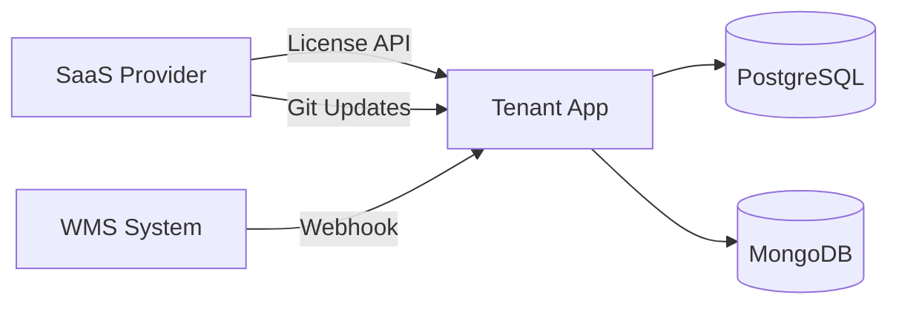

# Technical Context

## Architecture Overview
Distributed B2B SaaS with physically isolated tenant instances. Each tenant has:
- Own server/hosting
- Custom domain (e.g., `akteknik.com`)
- Dedicated PostgreSQL + MongoDB databases
- License validation via central SaaS Provider API



## Directory Structure (Implemented)
```
tenant-app/                    # Laravel 12 Backend
├── app/
│   ├── Enums/                 # OrderStatus, UserRole, SyncType, CampaignType
│   ├── Exceptions/            # LicenseExpiredException
│   ├── Http/
│   │   ├── Controllers/
│   │   │   ├── Api/           # Auth, Product, Cart, Order
│   │   │   │   └── Admin/     # OrderController, UpdateController
│   │   │   └── Webhook/       # WmsWebhookController
│   │   └── Middleware/        # LicenseMiddleware, AdminMiddleware
│   ├── Jobs/                  # WmsSyncStockJob, ProcessWebhookJob
│   ├── Models/                # 10 Eloquent models (with is_in_stock accessor)
│   └── Services/
│       ├── License/           # LicenseService, LicenseResponse
│       ├── Update/            # SelfUpdateService
│       └── Wms/               # WmsApiClient, WmsWebhookHandler, WmsStockSyncService
├── config/
│   ├── license.php            # Provider URL, grace period (72h)
│   └── wms.php                # WMS API config, sync interval (5min)
├── database/migrations/       # 12 migration files
└── routes/
    ├── api.php                # 24 API endpoints
    └── console.php            # Scheduler with WMS sync job

tenant-frontend/               # Angular 19 Frontend
├── src/app/
│   ├── core/
│   │   ├── guards/            # auth.guard.ts, admin.guard.ts
│   │   ├── interceptors/      # auth.interceptor.ts, error.interceptor.ts
│   │   ├── models/            # TypeScript interfaces
│   │   └── services/          # Auth, Product, Cart, Order, ExchangeRate
│   ├── shared/
│   │   └── components/        # HeaderComponent
│   └── features/
│       ├── auth/              # LoginComponent, LicenseExpiredComponent
│       ├── products/          # ProductListComponent, ProductFilterComponent
│       ├── cart/              # CartComponent
│       ├── orders/            # OrderListComponent, OrderDetailComponent
│       └── admin/             # AdminOrdersComponent
└── tailwind.config.js
```

## Database Schema (12 Tables)
- users (extended with role, is_active, last_login_at)
- brands, categories, products
- carts, cart_items
- orders, order_items, shipment_types
- campaigns, license_cache
- personal_access_tokens (Sanctum)

## Test Data (Created)
| Type | Items |
|------|-------|
| Users | admin@test.com (password123) |
| Brands | Bosch, Siemens |
| Categories | Electronics, Motors |
| Products | 4 (3 in stock, 1 out of stock) |
| Shipment Types | Standard ($10), Express ($25) |

## Dependencies
- Laravel 12 (PHP 8.4+)
- Laravel Sanctum (API tokens)
- Angular 19 (Standalone APIs)
- Tailwind CSS 3.x
- PostgreSQL 16+
- MongoDB 7+ (for logs)
- Redis (caching)

## Development Setup
```bash
# Laravel Backend
cd tenant-app
composer install
cp .env.example .env
php artisan key:generate
php artisan migrate
php artisan serve --port=8000

# Angular Frontend
cd tenant-frontend
npm install
npx ng serve --port=4200
```

## Environment Variables
- `LICENSE_KEY`: Tenant's unique license key
- `LICENSE_PROVIDER_URL`: SaaS provider API URL
- `LICENSE_CACHE_TTL`: Cache duration (default: 3600s)
- `LICENSE_GRACE_PERIOD_HOURS`: Grace period (default: 72h)
- `WMS_API_URL`: WMS system endpoint
- `WMS_API_KEY`: WMS authentication
- `WMS_WEBHOOK_SECRET`: Webhook signature validation
- `WMS_SYNC_INTERVAL`: Sync frequency (default: 5 min)
- `DB_CONNECTION`: pgsql
- `MONGODB_URI`: MongoDB connection string

## API Endpoints (24 Total)
| Method | Endpoint | Auth | Description |
|--------|----------|------|-------------|
| POST | /api/auth/login | - | User login |
| POST | /api/auth/logout | ✓ | User logout |
| GET | /api/auth/me | ✓ | Current user info |
| GET | /api/products | ✓ | List with filters |
| GET | /api/products/{id} | ✓ | Product detail |
| GET | /api/brands | ✓ | Active brands |
| GET | /api/categories | ✓ | Category tree |
| GET | /api/cart | ✓ | View cart |
| POST | /api/cart/items | ✓ | Add to cart |
| PUT | /api/cart/items/{id} | ✓ | Update quantity |
| DELETE | /api/cart/items/{id} | ✓ | Remove item |
| DELETE | /api/cart | ✓ | Clear cart |
| GET | /api/orders | ✓ | User orders |
| POST | /api/orders | ✓ | Place order |
| GET | /api/orders/{id} | ✓ | Order detail |
| GET | /api/shipment-types | ✓ | Shipping options |
| GET | /api/admin/orders | Admin | All orders |
| GET | /api/admin/orders/pending | Admin | Pending orders |
| POST | /api/admin/orders/{id}/approve | Admin | Approve order |
| PUT | /api/admin/orders/{id}/status | Admin | Update status |
| GET | /api/admin/updates/check | Admin | Check updates |
| POST | /api/admin/updates/perform | Admin | Run update |
| POST | /api/wms/webhook | Signature | WMS events |

## Recent Bug Fixes
- **Stock Status Display**: Added `$appends = ['is_in_stock']` and `getIsInStockAttribute()` accessor to Product model

## Known Issues
- Cart API returns 500 error on `POST /api/cart/items` - needs debugging
- LicenseMiddleware temporarily disabled (requires SaaS Provider)

---
*Son güncelleme: 2025-12-25*
